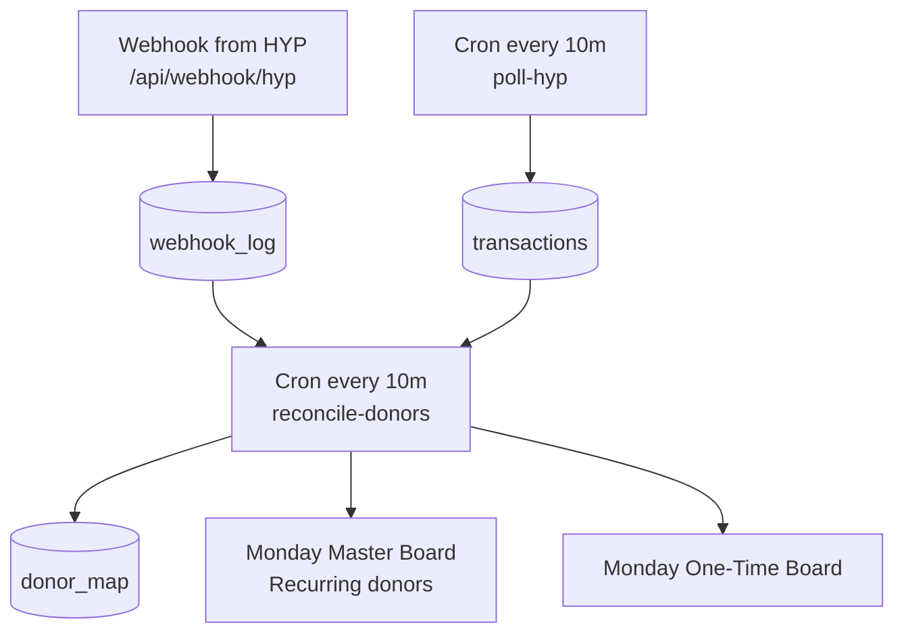
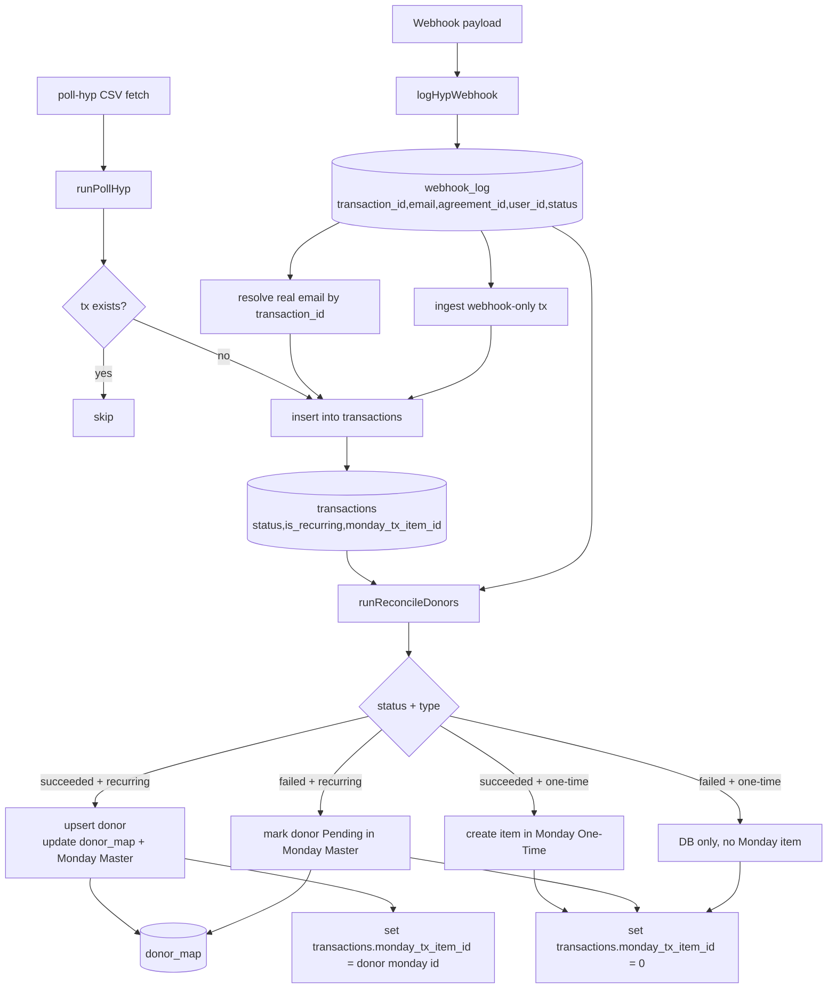

# Donation Flow (Webhook + Jobs + Monday)

המסמך מציג את הזרימה ב-3 רמות:
- **רמה 1**: בסיסית (המקורות, הטבלאות, Monday)
- **רמה 2**: רמה 1 + איך נתונים מתעדכנים/משתנים לאורך הדרך
- **רמה 3**: רמה 2 + פונקציות מרכזיות במערכת

---

## רמה 1 — בסיסית



**מה זה אומר בפועל:**
- `webhook` מזין את `webhook_log`.
- `poll-hyp` מזין את `transactions`.
- `reconcile-donors` מחבר בין הנתונים ומבצע סנכרון ל-`donor_map` ול-Monday.

---

## רמה 2 — בסיסית + עדכוני דאטה / שינוי מידע



**דגשים לרמה 2:**
- `transactions.email` יכול להתחיל כ-`@noemail.hyp` ובהמשך להיפתר למייל אמיתי דרך `webhook_log`.
- `monday_tx_item_id` הוא שדה בקרה:
  - `NULL` = עדיין לא טופל ב-reconcile
  - `0` = טופל ללא item של תורם (למשל failed / one-time)
  - מספר חיובי = מזהה item ב-Monday (בעיקר recurring)
- **כישלונות**:
  - recurring failed → סטטוס תורם ב-Monday הופך ל-`Pending` (אם נמצא תורם).
  - one-time failed → נשמר ב-DB בלבד, ללא יצירת item ב-Monday.

---

## רמה 3 — רמה 2 + פונקציות מרכזיות

```mermaid
flowchart TD
    A[/api/webhook/hyp] --> B[logHypWebhook\nsrc/routes/webhook.ts]
    B --> C[(webhook_log)]

    D[Cron poll-hyp] --> E[runPollHyp\nsrc/jobs/poll-hyp.ts]
    E --> F[fetchHypTransactions\nsrc/lib/hyp-poll.ts]
    E --> G[csvRowToTransaction\nsrc/lib/hyp-poll.ts]
    E --> H[ingestWebhookOnlyTransactions\nsrc/jobs/poll-hyp.ts]
    E --> I[(transactions)]

    J[Cron reconcile-donors] --> K[runReconcileDonors\nsrc/jobs/reconcile-donors.ts]
    K --> L[resolveEmail\nsrc/jobs/reconcile-donors.ts]
    K --> M[upsertDonor\nsrc/lib/donor-service.ts]
    K --> N[markDonorPendingByEmail\nsrc/lib/donor-service.ts]

    M --> O[createDonorItem / updateDonorItem\nsrc/lib/monday.ts]
    M --> P[createOneTimeDonationItem\nsrc/lib/monday.ts]
    O --> Q[Monday Master Board]
    P --> R[Monday One-Time Board]

    K --> S[(donor_map)]
    K --> I
    C --> L
    I --> K
```

**פונקציות עיקריות (Quick Map):**
- `logHypWebhook` — קליטת webhook ושמירה ל-`webhook_log`.
- `runPollHyp` — שליפת עסקאות מ-HYP ושמירה ל-`transactions`.
- `ingestWebhookOnlyTransactions` — הכנסת עסקאות שקיימות רק ב-webhook.
- `runReconcileDonors` — מנוע התאמה ועדכון Monday.
- `resolveEmail` — מציאת מייל אמיתי לפי `transactionId`/`agreementId`/`userId`.
- `upsertDonor` — יצירה/עדכון תורם ב-`donor_map` ו-Monday.
- `markDonorPendingByEmail` — סימון recurring donor כ-`Pending`.

